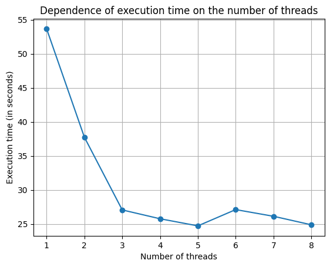

# LeastSquaresOpenMP

This project implements the Least Squares Method for polynomial fitting using OpenMP for parallelization.

## Implementation Overview

The implementation involves the following steps:

1. **Matrix and Vector Initialization**:  
   The matrix **A** and vector **b** are filled according to the least squares theory using **OpenMP** parallelization. The matrix **A** is constructed using the data points, and the vector **b** represents the corresponding y-values.

2. **Solving the System**:  
   The system of linear equations **Ax = b** is solved using **Gaussian elimination** with **OpenMP** parallelization. Both the forward elimination and backward substitution steps are parallelized to optimize the performance for solving the system with different numbers of threads.

## Installation
### Clone the repository

First, clone the repository to your local machine:

```
git clone https://github.com/ONETWOSUNSHINE/LeastSquaresOpenMP.git
cd LeastSquaresOpenMP
```
### Build the project

This project uses **make** for building. To build the project, simply run the following command in the root directory of the repository:

```
mkdir build
cd build
cmake ..
make
```
## Run the program

Input file structure: The first line contains the degree of the output polynomial, and each subsequent line contains an x and y value separated by a space.

```
>./lsq
Usage:
 ./lsq <input_file> [-pt]
   -pt = Threads performance test (1-8)
>./lsq ../tests/test_1.txt
Coefficients of a polynomial of degree 2:
 x^0: 1.44
 x^1: 0.707143
 x^2: 0.00714286
Elapsed time (sec): 0.000805397
Threads performance test is completed
```
Results will be saved in a file named <input_filename>_results.txt, and the execution time for different threads will be recorded in <input_filename>_threads_execution_time.txt.

## Results Comparison

The results obtained from this method are compared with the results provided by the `numpy.polyfit` library in Python.

### Example Code

To compare the results with `numpy.polyfit`, you can use the following Python code:

```python
import numpy as np
filename = "test_1.txt"
data = np.loadtxt(filename, skiprows=1)

x = data[:, 0]
y = data[:, 1]
degree = 2

coeffs_numpy = np.polyfit(x, y, degree)
print("Coefficients from numpy.polyfit:", coeffs_numpy)

-> Coefficients of a polynomial: [0.00714286 0.70714286 1.44      ]
```
## Performance Test

The performance test was conducted on generated data, which was created using the following command:

```
>python ../tests/generated_data.py
```

